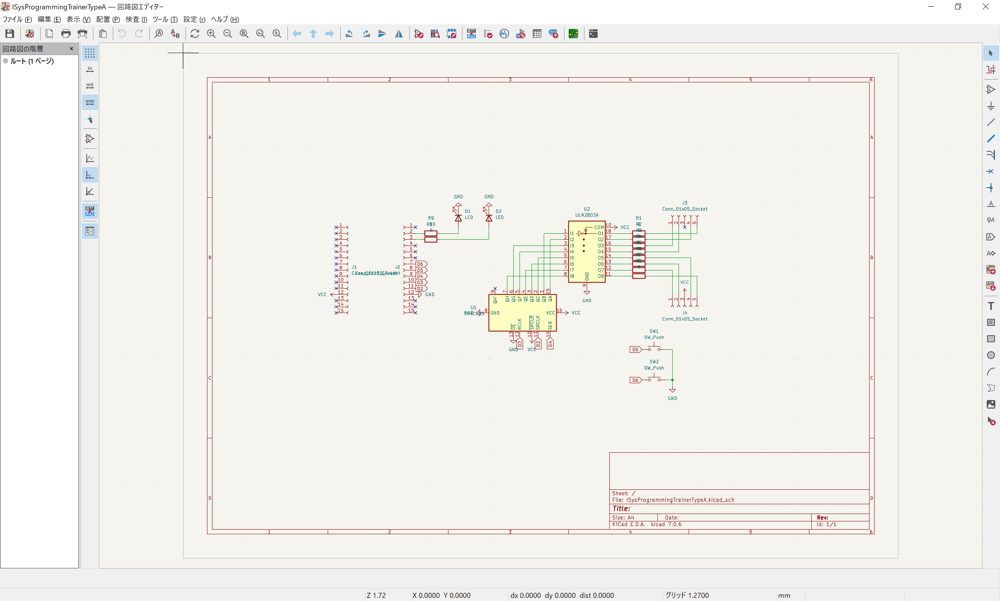
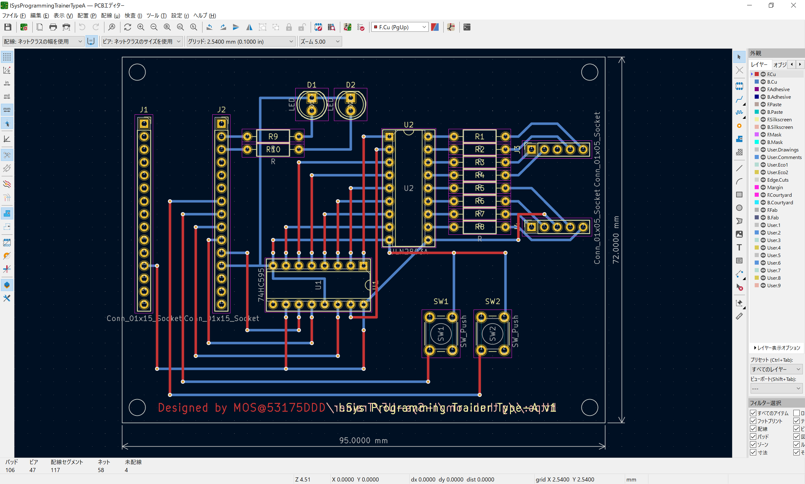
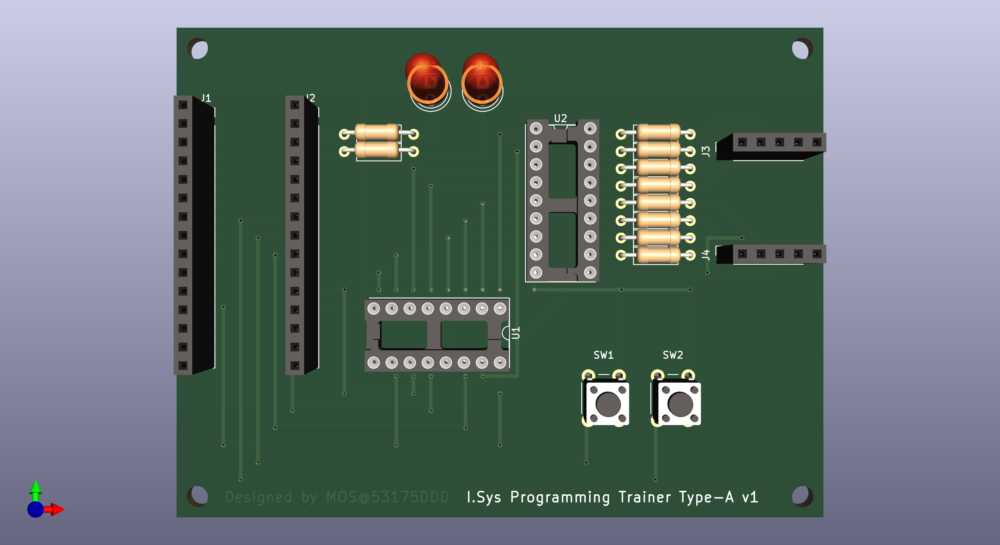
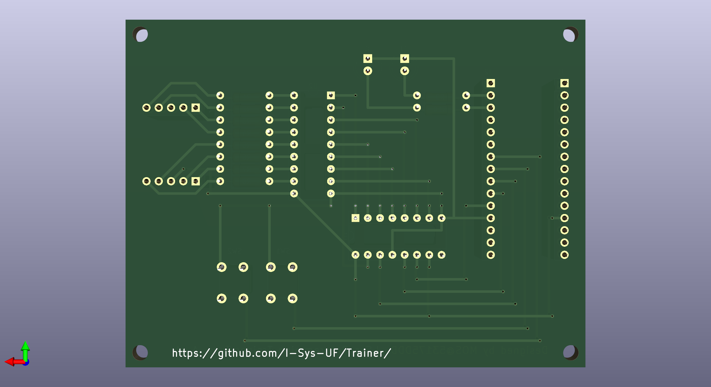

# I.Sys Programming Trainer の使い方

## KiCAD プロジェクト

`./ISysProgrammingTrainerTypeA/` 以下に配置

### 回路図

  

### 基板デザイン

  

### 3D プレビュー

  
  

## 目次みたいなの

- 部品表や完成品を見ながら，組み立てる
  - 部品と基板は予め人数分用意しておく
- リポジトリを丸ごとダウンロードする
- デモプログラムを動かす
  - `./TrainingKit-demo/TrainingKit-demo.ino` を実行する
  - いくつか数字を変えてみる（`#define hoge fuga` の箇所のみ）
- Train-1 を動かす
  - 単純に GPIO 直結 LED を光らせるだけ
  - ボード上に LED があるので，好きに光らせてみよう
- Train-2 を動かす
  - if 文を使う練習
  - まずは `if(true)` と `if(false)` を動かす
  - スイッチを読み取り，押されているときに LED を光らせてみる
  - 逆もやってみよう
- Train-3 を動かす
  - 関数を作る
  - 任意の f(x) の式を実装
- Train-4 を動かす
  - シフトレジスタにデータを送る練習
    - 関数は予め用意したものを使う（いきなり作るのは難しいので）
  - 適当な 8bit の値をセットし，送ってみよう
  - 何かしらの特定の 1bit だけ立てたデータを送り，どのセグメントと対応しているかを確認しよう
  - どんなデータをおくったら表示させたい数字を表示させれるかを考えてみよう
- Train-5 を動かす
  - 配列を使う練習
  - Train-4 で調べたデータを配列にし，インデックスの値と光り方が一致するように作る
- Train-6 を動かす
  - for 文を使う練習
  - Train-5 で作った配列を活用し，0 ~ 9 まで順に光らせてみよう
  - HEX に対応できるように，A ~ F も作ってみよう（一部小文字になる）
- Train-7 を動かす
  - スイッチが押されたことを検知する
  - 押された瞬間にカウントアップ / ダウンし，その結果の値を表示する
- Train-8 を動かす
  - タイマー割り込みを使う練習，兼，外部ライブラリを使う練習
    - MsTimer2 を利用する
  - タイマー割り込みを使用し，定期的に値を更新するようなプログラムを作る（demo とやっていることは同じ）

ここまでできたら，オリジナルのプログラムを作ってみよう  
以下に例を示すので興味があれば作ってみるといい練習になる

- 7 セグの A ~ F を順に光らせてグルグルさせる
- A -> B -> G -> E -> D -> C -> G -> F の順に 8 の字を描くように光らせる
- ボタンが押されているときに，その押されているスイッチの番号を表示する
  - 押されている間だけ表示し続けるバージョン
  - 押された瞬間に表示を更新するバージョン
    - これはタイマー割り込みを使わなくても作れるが，どちらでもよい
  - 押されているスイッチの番号の和を表示する
- 乱数を生成する関数 `rand()` を使ってサイコロを作る
  - SW1 を押したら乱数の生成を始め，随時表示を更新する
  - SW2 を押したら値を確定させる
  - 上記はあくまでも例．押している間に生成し離したら確定でももちろん問題ない
